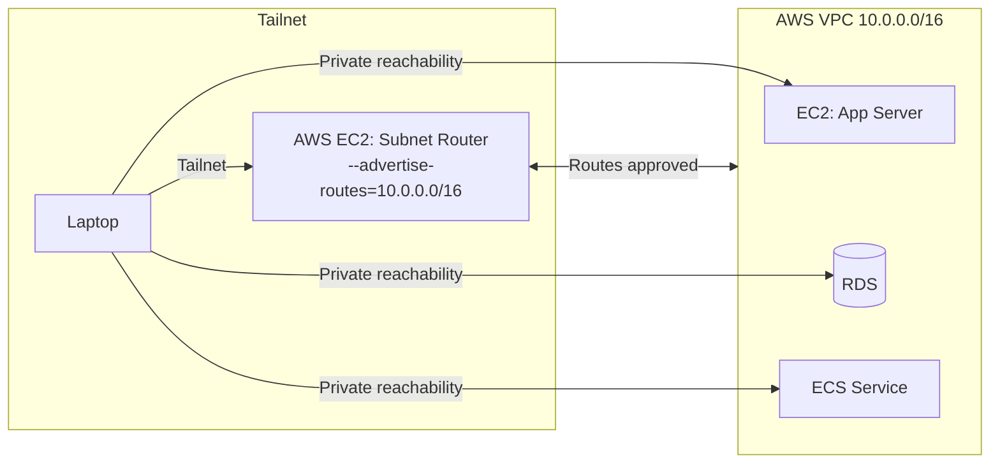
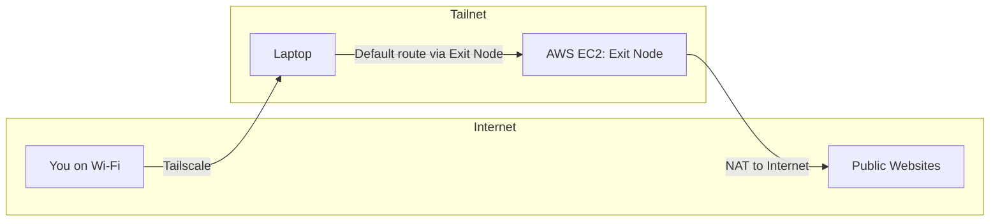
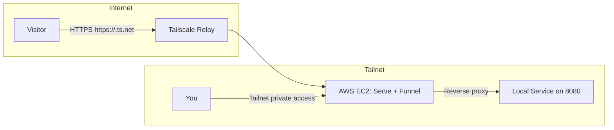

# Tailscale Ingress VPN on AWS

This guide shows how to set up an AWS EC2 instance as an ingress point into your Tailscale tailnet. You can route traffic into your tailnet, use the instance as a secure exit node, or bridge private AWS resources into your tailnet.  

The setup is lightweight and can be deployed on a free-tier or low-cost instance. It works well as a personal VPN gateway or as a foundation for more advanced cloud networking.

---

## Use Cases
- **Personal VPN gateway**  
  Secure entry point into a tailnet that includes your devices at home or on the road.

- **Exit node for browsing**  
  Route all internet traffic through AWS to protect activity on untrusted networks or appear from the AWS region.

- **Bridge into AWS private networks**  
  Reach EC2 instances, RDS databases, or other services in your AWS VPC without public exposure.

- **Jump host for administration**  
  Use the AWS instance as a central SSH or admin node without opening inbound ports publicly.

---

## Features
- Deployable on a free-tier or low-cost AWS instance (`t3.micro` or `t4g.micro`)  
- Provides private ingress into your tailnet  
- Supports:
  - Tailscale SSH access  
  - Subnet routing into AWS VPC  
  - Exit node functionality (route all traffic through AWS)  
  - Optional Funnel support to expose web services publicly  

---

## Prerequisites
- AWS account with EC2 access  
- Tailscale account (Free tier works, Funnel requires Personal Pro or higher)  
- Basic familiarity with Linux and SSH  

---

## Step 1: Launch the AWS Instance
1. Open the EC2 console and create a new instance.  
2. Choose Ubuntu 22.04 LTS as the AMI.  
3. Select `t3.micro` (x86, free tier) or `t4g.micro` (ARM, cheaper).  
4. Assign an Elastic IP so the public address does not change.  
5. Security group: allow inbound SSH (22). If you intend to use Funnel, also allow inbound ports 80 and 443.  

---

## Step 2: Install and Configure Tailscale
SSH into the instance and install Tailscale:

```bash
curl -fsSL https://tailscale.com/install.sh | sh
sudo systemctl enable --now tailscaled
sudo tailscale up --ssh
```

Follow the authentication URL and log in to your Tailscale account. Once completed, the node will appear in your tailnet.

---

## Step 3: Optional Enhancements

### Subnet Routing
Advertise the AWS VPC range to your tailnet:

```bash
sudo tailscale up --ssh --advertise-routes=10.0.0.0/16
```

Approve the route in the Tailscale admin console.



---

### Exit Node
Advertise the instance as an exit node:

```bash
sudo tailscale up --ssh --advertise-exit-node
```

Enable the exit node in your Tailscale client to route internet traffic through AWS. Your public IP should change to match the AWS Elastic IP.



---

### Funnel
Serve a local service inside your tailnet:

```bash
sudo tailscale serve --bg 8080
```

Enable funneling to expose it to the internet:

```bash
sudo tailscale funnel 8080
```

Visit `https://<aws-node>.ts.net/` to access the service. Funnel requires a paid Tailscale plan.



---

## Security Notes
- Prefer Tailscale SSH instead of exposing port 22 to the public internet.  
- Limit inbound rules in your AWS security group.  
- Manage access using [Tailscale ACLs](https://tailscale.com/kb/1018/acls).  
- If using an exit node, all internet traffic will be routed through the AWS instance. Treat the instance as a trusted point of control.  

---

## Common Issues

**Symptom:** Connecting to the AWS node as an exit node causes loss of internet.  
**Cause:** The AWS instance is not forwarding or NATing outbound traffic.  
**Fix:**  

1. Enable packet forwarding:
   ```bash
   echo 'net.ipv4.ip_forward=1' | sudo tee /etc/sysctl.d/99-tailscale.conf
   echo 'net.ipv6.conf.all.forwarding=1' | sudo tee -a /etc/sysctl.d/99-tailscale.conf
   sudo sysctl -p /etc/sysctl.d/99-tailscale.conf
   ```

2. Disable Source/Destination Check in AWS:  
   EC2 Console → Instance → Networking → Change Source/Dest Check → Disable  

3. Add NAT masquerading if missing:
   ```bash
   sudo iptables -t nat -A POSTROUTING -o eth0 -j MASQUERADE
   ```
   Replace `eth0` with your network interface.  

Reconnect to the exit node. Your public IP should now match the AWS Elastic IP.  

---

## Cost
- AWS `t3.micro` may be free on the AWS Free Tier  
- Without free tier, expect about $7 per month   
